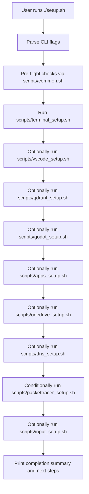

# Architecture

## High-Level Overview

The repository implements a scripted, asset-driven setup pipeline for a personalized terminal and development environment on Nobara 42 and other Fedora-based systems.

- [`setup.sh`](../../setup.sh:1) is the **master orchestrator**.
- [`scripts/`](../../scripts:1) contains task-focused Bash scripts for core setup, enhancement, and tooling.
- [`assets/`](../../assets:1) contains **all user-specific configuration and data** (dotfiles, fonts, app configs) that scripts restore into the system.

At a high level, the system:

1. Validates that it is running as a non-root user with sudo access.
2. Uses `dnf` and other installers to provision packages and tools.
3. Copies configuration files and directories from [`assets/`](../../assets:1) into the user's home directory (overwrites without backup).
4. Optionally installs and configures extra tools (Qdrant, Godot, apps, Packet Tracer).

## Orchestration Flow

[`setup.sh`](../../setup.sh:1) parses CLI arguments and drives the overall flow:

- Global flags:
  - **Exclusive Mode Triggers**: Providing any component flag switches the script to **Exclusive Mode**, where only explicitly requested components run.
    - `--full`: Runs the full standard setup (explicitly enables all standard components).
    - Component flags: `--terminal`, `--vscode`, `--qdrant`, `--godot`, `--apps`, `--packettracer`, `--easyeffects`, `--onedrive`, `--vietnamese`.
  - **Skip Flags**: Used in default mode (no exclusive flags) to selectively disable components (e.g., `--skip-vscode`, `--skip-godot`).
- Performs pre-flight checks via utilities in [`scripts/common.sh`](../../scripts/common.sh:1):
  - Enforces **non-root** execution.
  - Verifies the assets directory exists.
- Executes setup scripts in this typical order:
  1. [`scripts/terminal_setup.sh`](../../scripts/terminal_setup.sh:1) (unless `--skip-terminal`)
  2. [`scripts/vscode_setup.sh`](../../scripts/vscode_setup.sh:1) (unless `--skip-vscode`)
  3. [`scripts/qdrant_setup.sh`](../../scripts/qdrant_setup.sh:1) (unless `--skip-qdrant`)
  4. [`scripts/godot_setup.sh`](../../scripts/godot_setup.sh:1) (unless `--skip-godot`)
  5. [`scripts/apps_setup.sh`](../../scripts/apps_setup.sh:1) (unless `--skip-apps`)
  6. [`scripts/easyeffects_setup.sh`](../../scripts/easyeffects_setup.sh:1) (unless `--skip-easyeffects`)
  7. [`scripts/dns_setup.sh`](../../scripts/dns_setup.sh:1) (unless `--skip-dns`)
  8. [`scripts/packettracer_setup.sh`](../../scripts/packettracer_setup.sh:1) (if not skipped and installer `.deb` exists)
  9. [`scripts/input_setup.sh`](../../scripts/input_setup.sh:1) (when `--vietnamese` is provided)
  10. [`scripts/onedrive_setup.sh`](../../scripts/onedrive_setup.sh:1) (when `--onedrive` is provided)
- Provides summary output and reminders (e.g., log out/in to pick up default shell changes).

### Orchestration Diagram

## Core Components

### Common Utilities

- File: [`scripts/common.sh`](../../scripts/common.sh:1)
- Responsibilities:
  - Define shared paths:
    - `PROJECT_ROOT` points to the repository root.
    - `BACKUP_DIR` points to [`assets/`](../../assets:1), the source of all configs.
  - Provide colored logging helpers (`log_info`, `log_warn`, `log_error`, `log_success`, `log_section`).
  - Basic utility functions:
    - `ensure_dir` to create directories.
    - `check_command` to test for program availability.
    - `run_sudo` and `dnf_install` to wrap privileged operations.
    - Safety checks like `check_not_root` and `verify_backup_dir`.
    - Copy helpers `copy_file` and `copy_dir` that overwrite without backup.

All other scripts **source** this file and rely on its utilities for consistent behavior and safety.

### Terminal Setup

- File: [`scripts/terminal_setup.sh`](../../scripts/terminal_setup.sh:1)
- Responsibilities (single, full-featured profile):
  - Perform `dnf update -y`.
  - Install core packages (zsh, git, curl, wget, util-linux-user, fastfetch, kitty, podman, podman-compose, tmux).
  - Install Starship and Atuin (dnf or official scripts).
  - Install Zsh plugins (autosuggestions, syntax-highlighting, autocomplete).
  - Install power tools (`zoxide`, `eza`, `bat`, `fzf`, `ripgrep`, `fd-find`).
  - Install `lazygit` (via COPR) and `yazi` (via prebuilt binary).
  - Install Tmux Plugin Manager (TPM) from GitHub.
  - Copy dotfiles (`.zshrc`, `.bashrc`, `.gitconfig`) and config directories (`starship`, `atuin`, `fastfetch`, `fish`, `kitty`, `tmux`) — overwrites without backup.
  - Install fonts (CaskaydiaCove Nerd Font) to `~/.local/share/fonts`.
  - Change default shell to Zsh.
  - Perform post-install steps (build bat cache, print guidance).

### Tooling and Apps Setup (External Integrations)

Additional scripts manage specific tools and applications:

- [`scripts/vscode_setup.sh`](../../scripts/vscode_setup.sh:1)
  - Installs VS Code (Microsoft repo).
  - Installs extensions listed in [`assets/vscode/extensions.txt`](../../assets/vscode/extensions.txt:1) (if present).
  - **Does NOT** restore VS Code settings or globalStorage to avoid storing secrets in version control.

- [`scripts/qdrant_setup.sh`](../../scripts/qdrant_setup.sh:1)
  - Uses Podman to run a Qdrant vector DB container.
  - Configures a systemd user service for automatic start at boot.
  - Exposes Qdrant at `http://localhost:6333`.

- [`scripts/godot_setup.sh`](../../scripts/godot_setup.sh:1)
  - Downloads Godot to `~/.local/bin/godot` (version configurable by `GODOT_VERSION`).
  - Restores Godot editor settings from [`assets/godot/`](../../assets/godot:1).
  - Creates a desktop entry for Godot.

- [`scripts/apps_setup.sh`](../../scripts/apps_setup.sh:1)
  - Installs Google Chrome and Dropbox using `dnf`.
  - Installs Discord, Obsidian, and Anki via Flatpak.

- [`scripts/onedrive_setup.sh`](../../scripts/onedrive_setup.sh:1)
  - Installs `abraunegg/onedrive` client.
  - Supports interactive setup for multiple accounts (e.g., Personal, Work).
  - Configures named systemd user services for automatic background sync.

- [`scripts/packettracer_setup.sh`](../../scripts/packettracer_setup.sh:1)
  - Locates a Cisco Packet Tracer `.deb` installer.
  - Installs necessary Qt5 dependencies and performs non-interactive installation.
  - Integrates Packet Tracer into the system.

- [`scripts/input_setup.sh`](../../scripts/input_setup.sh:1)
  - Installs `ibus` and `ibus-bamboo` for Vietnamese input (smart repo resolution).
  - Configures environment variables (`GTK_IM_MODULE`, `QT_IM_MODULE`, `XMODIFIERS`) in `~/.profile`.
  - Automatically adds Bamboo to GNOME input sources and sets it as default via `gsettings` and `dconf`.

- [`scripts/easyeffects_setup.sh`](../../scripts/easyeffects_setup.sh:1)
  - Installs EasyEffects via `dnf`.
  - Restores audio presets and autoload rules from [`assets/.config/easyeffects`](../../assets/.config/easyeffects:1) into `~/.config/easyeffects`.
  - Optionally copies config into Flatpak path (`~/.var/app/com.github.wwmm.easyeffects/`) if present.
  - Controlled by `--skip-easyeffects` flag.

- [`scripts/dns_setup.sh`](../../scripts/dns_setup.sh:1)
  - Configures system DNS to Cloudflare Block Malware (1.1.1.2/1.0.0.2) via `nmcli`.
  - Sets `ignore-auto-dns` to yes for both IPv4 and IPv6.
  - Restarts the active network connection to apply changes.
  - Controlled by `--skip-dns` flag.

## Assets and Configuration Layout

The [`assets/`](../../assets:1) directory serves as the **configuration source of truth**. Key subtrees:

- Root-level dotfiles:
  - [`assets/.zshrc`](../../assets/.zshrc:1)
  - [`assets/.bashrc`](../../assets/.bashrc:1)
  - [`assets/.gitconfig`](../../assets/.gitconfig:1)
- App-level configuration under [`assets/.config/`](../../assets/.config:1):
  - `starship`, `atuin`, `fastfetch`, `kitty`, `tmux`, and others as needed.
- Fonts under [`assets/fonts/`](../../assets/fonts:1) (CaskaydiaCove Nerd Font).
- Tool-specific extras:
  - [`assets/images/jedi.png`](../../assets/images/jedi.png:1) for `fastfetch`.
  - Godot settings and themes under [`assets/godot/`](../../assets/godot:1).
  - VS Code extensions list under [`assets/vscode/extensions.txt`](../../assets/vscode/extensions.txt:1).
  - EasyEffects audio presets and autoload rules under [`assets/.config/easyeffects`](../../assets/.config/easyeffects:1).

Scripts treat these as **immutable inputs**, copying them into the user's home directory and overwriting existing files without backup.

## Critical Design Decisions

- **Non-root execution**: All scripts enforce `check_not_root` to avoid running the orchestrator or sub-scripts as root. Privileged operations are performed via `sudo` only where required.
- **Overwrite without backup**:
  - Copy operations overwrite user-level configs directly.
  - The repo is the single source of truth; to update config, edit in repo and re-run setup.
  - Fonts and configs can be re-copied without breaking existing setups.
- **Separation of logic and data**:
  - Bash scripts contain **procedural logic**.
  - [`assets/`](../../assets:1) contains **all user-specific configuration data**, making it easy to adjust the environment by editing assets rather than rewriting scripts.
- **Feature modularity**:
  - Each major feature (VS Code, Qdrant, Godot, apps, Packet Tracer) lives in its own script.
  - `setup.sh` composes these features via flags and skip options.
- **Tmux plugins via TPM**:
  - Tmux Plugin Manager is cloned from GitHub into `~/.tmux/plugins/tpm`.
  - Plugins are listed in `tmux.conf` and installed by user pressing `prefix + I`.
  - No vendor plugin directories in the repo.

## Future Extension Points

- Additional tools can follow the established pattern:
  - Add new configuration into [`assets/`](../../assets:1).
  - Create a new script in [`scripts/`](../../scripts:1) to install/configure that tool using `common.sh` utilities.
  - Wire the script into [`setup.sh`](../../setup.sh:1) behind a flag or as part of the default flow.
- New Memory Bank files (e.g. tasks, deployment notes, troubleshooting guides) can document workflows that span multiple scripts and assets.