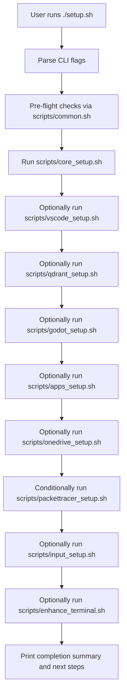

# Architecture

## High-Level Overview

The repository implements a scripted, asset-driven setup pipeline for a personalized terminal and development environment on Nobara 42 and other Fedora-based systems.

- [`setup.sh`](../../setup.sh:1) is the **master orchestrator**.
- [`scripts/`](../../scripts:1) contains task-focused Bash scripts for core setup, enhancement, and tooling.
- [`assets/`](../../assets:1) contains **all user-specific configuration and data** (dotfiles, fonts, app configs) that scripts restore into the system.

At a high level, the system:

1. Validates that it is running as a non-root user with sudo access.
2. Uses `dnf` and other installers to provision packages and tools.
3. Copies configuration files and directories from [`assets/`](../../assets:1) into the user’s home directory.
4. Optionally installs and configures extra tools (Qdrant, Godot, apps, Packet Tracer).
5. Optionally performs a **terminal enhancement** step that installs power tools and replaces base configs with enhanced variants.

## Orchestration Flow

[`setup.sh`](../../setup.sh:1) parses CLI arguments and drives the overall flow:

- Global flags:
  - `--minimal` turns on a reduced installation, skipping Qdrant, Godot, apps, and Packet Tracer.
  - `--enhance` enables terminal enhancement.
  - `--skip-*` flags allow selectively skipping VS Code, Qdrant, Godot, apps, EasyEffects, and Packet Tracer.
  - **Exclusive Mode**: If specific component flags (e.g., `--vscode`, `--qdrant`) are provided, `setup.sh` switches to exclusive mode and runs **only** the requested components.
- Performs pre-flight checks via utilities in [`scripts/common.sh`](../../scripts/common.sh:1):
  - Enforces **non-root** execution.
  - Verifies the backup/assets directory exists.
- Executes setup scripts in this typical order:
  1. [`scripts/core_setup.sh`](../../scripts/core_setup.sh:1) (always runs)
  2. [`scripts/vscode_setup.sh`](../../scripts/vscode_setup.sh:1) (unless `--skip-vscode`)
  3. [`scripts/qdrant_setup.sh`](../../scripts/qdrant_setup.sh:1) (unless `--skip-qdrant` or `--minimal`)
  4. [`scripts/godot_setup.sh`](../../scripts/godot_setup.sh:1) (unless `--skip-godot` or `--minimal`)
  5. [`scripts/apps_setup.sh`](../../scripts/apps_setup.sh:1) (unless `--skip-apps` or `--minimal`)
  6. [`scripts/easyeffects_setup.sh`](../../scripts/easyeffects_setup.sh:1) (unless `--skip-easyeffects`)
  7. [`scripts/onedrive_setup.sh`](../../scripts/onedrive_setup.sh:1) (when `--onedrive` is provided)
  8. [`scripts/packettracer_setup.sh`](../../scripts/packettracer_setup.sh:1) (if not skipped and installer `.deb` exists)
  9. [`scripts/input_setup.sh`](../../scripts/input_setup.sh:1) (when `--vietnamese` is provided)
  10. [`scripts/enhance_terminal.sh`](../../scripts/enhance_terminal.sh:1) (when `--enhance` is provided)
- Provides summary output and reminders (e.g., log out/in to pick up default shell changes).

### Orchestration Diagram

## Core Components

### Common Utilities

- File: [`scripts/common.sh`](../../scripts/common.sh:1)
- Responsibilities:
  - Define shared paths:
    - `PROJECT_ROOT` points to the repository root.
    - `BACKUP_DIR` points to [`assets/`](../../assets:1), the source of all configs.
  - Provide colored logging helpers (`log_info`, `log_warn`, `log_error`, `log_success`, `log_section`).
  - Basic utility functions:
    - `ensure_dir` to create directories.
    - `check_command` to test for program availability.
    - `run_sudo` and `dnf_install` to wrap privileged operations.
    - Safety checks like `check_not_root` and `verify_backup_dir`.
    - Copy helpers `copy_with_backup` and `copy_dir` that back up existing files where appropriate.

All other scripts **source** this file and rely on its utilities for consistent behavior and safety.

### Core System Setup

- File: [`scripts/core_setup.sh`](../../scripts/core_setup.sh:1)
- Responsibilities:
  - Perform `dnf update -y` to bring the system up to date.
  - Install core packages:
    - Shell/tools: `zsh`, `git`, `curl`, `wget`, `util-linux-user`, `fastfetch`, `tmux`.
    - Terminal: `kitty`.
    - Containers: `podman`, `podman-compose`.
  - Install Starship:
    - Prefer `dnf`, fall back to official install script if not available in repos.
  - Install Atuin:
    - Prefer `dnf`, fall back to official script.
  - Install Zsh plugins:
    - `zsh-autosuggestions`, `zsh-syntax-highlighting`.
    - `zsh-autocomplete` via `dnf` if possible, else clone into `$HOME/.local/share/zsh/plugins`.
  - Restore dotfiles from [`assets/`](../../assets:1):
    - `.zshrc`, `.bashrc`, `.gitconfig` (with backup of any existing `.gitconfig`).
    - If local `zsh-autocomplete` is used, rewrite the plugin path inside `.zshrc`.
  - Restore `.config` directories:
    - `starship`, `atuin`, `fastfetch`, `fish`, `kitty`, `tmux`.
    - Ensure custom `fastfetch` logos (e.g. `jedi.png`) are placed into the correct assets directory under `~/.config/fastfetch`.
  - Install fonts:
    - Copy all `.ttf` files from [`assets/fonts/`](../../assets/fonts:1) into `~/.local/share/fonts`.
    - Run `fc-cache -fv` to refresh font cache.
  - Change default shell to Zsh via `chsh`, if not already Zsh.

### Terminal Enhancement

- File: [`scripts/enhance_terminal.sh`](../../scripts/enhance_terminal.sh:1)
- Responsibilities:
  - Install power tools:
    - Using `dnf` for `zoxide`, `eza`, `bat`, `fzf`, `ripgrep`, `fd-find`.
  - Install Lazygit:
    - Enable COPR repo `atim/lazygit` if necessary.
    - Install via `dnf`.
  - Install Yazi:
    - Download prebuilt binary zip from GitHub.
    - Extract and install `yazi` and `ya` under `~/.local/bin`.
  - Install Tmux Plugin Manager (TPM):
    - Clone TPM into `~/.tmux/plugins/tpm` if not already present.
  - Apply enhanced configs from [`assets/`](../../assets:1):
    - Replace `~/.zshrc` with `assets/.zshrc.enhanced` (backing up any existing file).
    - Replace `~/.config/tmux/tmux.conf` with `tmux.conf.enhanced`.
    - Replace or create `~/.config/kitty/kitty.conf` from `kitty.conf.enhanced`.
    - Copy Catppuccin Kitty theme and Catppuccin Starship theme into appropriate config locations.
    - Optionally restore configs for tools like `yazi` and `bat` if present in assets.
  - Perform post-install steps:
    - Build `bat` theme cache if `bat` is installed.
    - Print guidance on new aliases, FZF keybindings, and tmux plugin installation.

### Tooling and Apps Setup (External Integrations)

Additional scripts manage specific tools and applications:

- [`scripts/vscode_setup.sh`](../../scripts/vscode_setup.sh:1)
  - Installs VS Code (Microsoft repo).
  - Restores VS Code settings and global storage from [`assets/vscode/`](../../assets/vscode:1).
  - Installs extensions listed in `extensions.txt`.

- [`scripts/qdrant_setup.sh`](../../scripts/qdrant_setup.sh:1)
  - Uses Podman to run a Qdrant vector DB container.
  - Configures a systemd user service for automatic start at boot.
  - Exposes Qdrant at `http://localhost:6333`.

- [`scripts/godot_setup.sh`](../../scripts/godot_setup.sh:1)
  - Downloads Godot to `~/.local/bin/godot` (version configurable by `GODOT_VERSION`).
  - Restores Godot editor settings from [`assets/godot/`](../../assets/godot:1).
  - Creates a desktop entry for Godot.

- [`scripts/apps_setup.sh`](../../scripts/apps_setup.sh:1)
  - Installs Google Chrome and Dropbox using `dnf`.
  - Installs Discord, Obsidian, and Anki via Flatpak.

- [`scripts/onedrive_setup.sh`](../../scripts/onedrive_setup.sh:1)
  - Installs `abraunegg/onedrive` client.
  - Supports interactive setup for multiple accounts (e.g., Personal, Work).
  - Configures named systemd user services for automatic background sync.

- [`scripts/packettracer_setup.sh`](../../scripts/packettracer_setup.sh:1)
  - Locates a Cisco Packet Tracer `.deb` installer.
  - Installs necessary Qt5 dependencies and performs non-interactive installation.
  - Integrates Packet Tracer into the system.

- [`scripts/input_setup.sh`](../../scripts/input_setup.sh:1)
  - Installs `ibus` and `ibus-bamboo` for Vietnamese input.
  - Configures environment variables (`GTK_IM_MODULE`, `QT_IM_MODULE`, `XMODIFIERS`) in `~/.profile`.

- [`scripts/easyeffects_setup.sh`](../../scripts/easyeffects_setup.sh:1)
  - Installs EasyEffects via `dnf`.
  - Restores audio presets and autoload rules from [`assets/.config/easyeffects`](../../assets/.config/easyeffects:1) into `~/.config/easyeffects`.
  - Optionally copies config into Flatpak path (`~/.var/app/com.github.wwmm.easyeffects/`) if present.
  - Controlled by `--skip-easyeffects` flag.

## Assets and Configuration Layout

The [`assets/`](../../assets:1) directory serves as the **configuration source of truth**. Key subtrees:

- Root-level dotfiles:
  - [`assets/.zshrc`](../../assets/.zshrc:1)
  - [`assets/.zshrc.enhanced`](../../assets/.zshrc.enhanced:1)
  - [`assets/.bashrc`](../../assets/.bashrc:1)
  - [`assets/.gitconfig`](../../assets/.gitconfig:1)
- App-level configuration under [`assets/.config/`](../../assets/.config:1):
  - `starship`, `atuin`, `fastfetch`, `kitty`, `tmux`, and others as needed.
- Fonts under [`assets/fonts/`](../../assets/fonts:1).
- Tool-specific extras:
  - [`assets/images/jedi.png`](../../assets/images/jedi.png:1) for `fastfetch`.
  - Godot settings and themes under [`assets/godot/`](../../assets/godot:1).
  - VS Code settings and Kilo Code plugin data under [`assets/vscode/`](../../assets/vscode:1).
  - EasyEffects audio presets (G560, G435) and autoload rules under [`assets/.config/easyeffects`](../../assets/.config/easyeffects:1).

Scripts primarily treat these as **immutable inputs**, copying them into the user’s home directory and only creating backups on the target side when overwriting.

## Critical Design Decisions

- **Non-root execution**: All scripts enforce `check_not_root` to avoid running the orchestrator or sub-scripts as root. Privileged operations are performed via `sudo` only where required.
- **Idempotent copying**:
  - Copy operations are safe to repeat; they overwrite user-level configs and keep timestamped backups.
  - Fonts and configs can be re-copied without breaking existing setups.
- **Separation of logic and data**:
  - Bash scripts contain **procedural logic**.
  - [`assets/`](../../assets:1) contains **all user-specific configuration data**, making it easy to adjust the environment by editing assets rather than rewriting scripts.
- **Feature modularity**:
  - Each major feature (VS Code, Qdrant, Godot, apps, Packet Tracer, enhancement) lives in its own script.
  - `setup.sh` composes these features via flags and skip options.

## Future Extension Points

- Additional tools can follow the established pattern:
  - Add new configuration into [`assets/`](../../assets:1).
  - Create a new script in [`scripts/`](../../scripts:1) to install/configure that tool using `common.sh` utilities.
  - Wire the script into [`setup.sh`](../../setup.sh:1) behind a flag or as part of the default flow.
- New Memory Bank files (e.g. tasks, deployment notes, troubleshooting guides) can document workflows that span multiple scripts and assets.